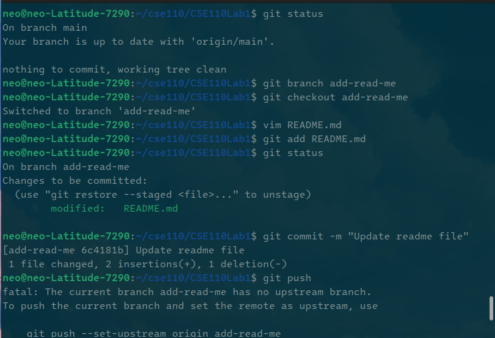

# CSE 110
## Lab 1
### Deliverable 1 - Command Line Git Clone



### Deliverable 2 - .gitignore, Commit Message

### Markdown Constructs

### Headings
# Heading
## Smol Heading
### Smolr 

### Styling text
**Bold**
*Italic*
~~Strikethrough~~
**Bold _and_ nested italic**
***All bold and italic***
H<sub>2</sub>O
E=mc<sup>2</sup>

### Quoting text
> Be me

> Am quote

### Quoting code
```
sudo apt install neofetch
neofetch
```
### External Links
[Here](https://findtheinvisiblecow.com) is a fun game. You will be tasked to find the invisible cow on the webpage. I can't believe the page is still up. 

### Section links
Hover over a rendered section of the page and click the link icon on the left.

### Relative links
[Here](README.md) is a link to the README.md file.

### Ordered and Unordered Lists
- this
- is
- unordered
1. this
2. is
3. ordered

### Task lists
Todo
- [x] Finish Lab 1
- [ ] Get off the CSE 110 Waitlist `:(`